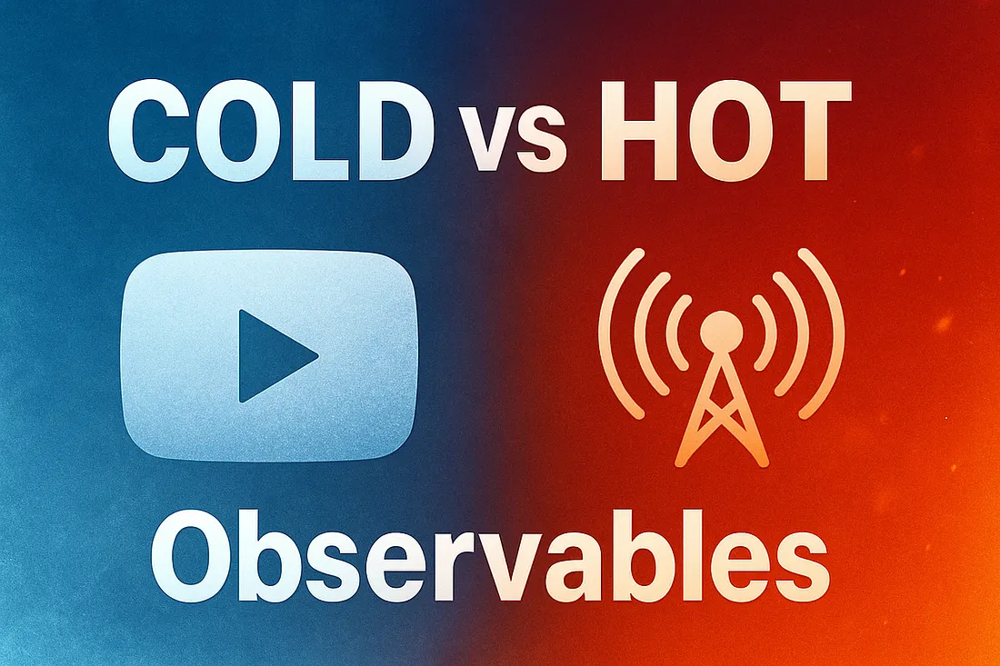

# Observables chauds, observables froids

## Un observable, c'est quoi ?
Un observable est un objet qui permet de produire des séquences de valeurs au fil du temps. Ces valeurs peuvent être des nombres, des chaînes de caractères, des objets, etc. En javascript, la bibliothèque RXJS est largement utilisée pour utiliser son implémentation du design pattern "Observable".

Pour utiliser des observables, vous devez d'abord créer un observable en utilisant l'un des constructeurs disponibles dans RxJS. Ensuite, vous pouvez souscrire à l'observable en utilisant la méthode `subscribe()`. Cela vous permet de spécifier une fonction à exécuter chaque fois qu'une valeur est produite par l'observable.

Voici un exemple simple d'observable qui produit les 5 premiers carrés (0, 1, 4, 9, 16) avec un délai d'une seconde entre chaque nombre :

```
import { interval, take, map } from 'rxjs'

const numbers = interval(1000).pipe(
    take(5),
    map((n) => n*n)
);

numbers.subscribe(x => console.log(x));
```
## Obserables chauds, observables froids



### Définitions des termes

Il existe 2 types d'observables : les observables **chauds** et les observables **froids**. 
- Les observables froids produisent des valeurs indépendamment de l'existence de souscriptions. Cela signifie que les observables froids recommencent à produire des valeurs à partir du début pour chaque nouvelle souscription.
- Les observables chauds ne produisent des valeurs que lorsqu'il y a des souscriptions actives. Ainsi, les observables chauds continuent à produire des valeurs à partir du moment où la première souscription est active.

### Une analogie

La différence entre observable "chaud" et observable "froid" peut se comprendre comme la différence entre une diffusion de vidéo en direct ou via un enregistrement (ou comme la télévision et youtube). 

Si j'allume la télévision, je n'aurais le journal télé que s'il est en cours de diffusion (c'est l'observable chaud). En revanche, si je vais sur une vidéo d'information sur Youtube, j'aurais accès à la vidéo que je veux quand je veux (c'est l'observable froid). 

>**A retenir**
>Un observable froid ne produit des valeurs qu’à chaque ``subscribe()``, tandis qu’un observable chaud génère un flux continu partagé par tous les abonnés.

### Exemple

```
// observable froid
const coldObservable = new Observable(observer => {
  observer.next(1);
  observer.next(2);
  observer.next(3);
  observer.complete();
});

// observable chaud
const hotObservable = new Subject();
hotObservable.next(1);
hotObservable.next(2);
hotObservable.next(3);
hotObservable.complete();

// souscription à un observable froid
coldObservable.subscribe(value => console.log(value));
// affichera 1, 2 et 3

// souscription à un observable chaud
hotObservable.subscribe(value => console.log(value));
// ne produira pas de valeurs car il n'y a pas eu de souscription active lorsque les valeurs ont été produites
```

## Sources de cette introduction : 
https://rxjs.fr/